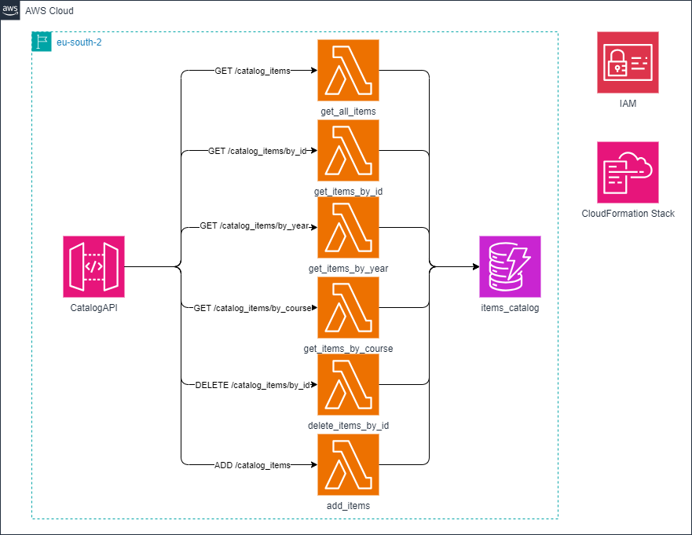

# Serverless knowledge catalog management system
## 1. Diagram
Diagram of the proposed architecture for the application:


## 2. API documentation
After deploying the application with AWS CDK (cdk deploy) the console will output the base URL path for interacting with the API. For example, https://exclp8y9a0.execute-api.your-region-2.amazonaws.com/prod/
All the following endpoints are added to this base URL with the corresponding HTTP methods.

<!-- GET ALL ITEMS -->
<table>
<!-- --------------------------- -->
<tr>
<td>

**GET `/catalog_items`**

</td>
</tr>
<!-- --------------------------- -->
<tr>
<td>

Retrieves all the items of the catalog

</td>
</tr>
<!-- --------------------------- -->
<tr>
<td>

Request: `GET /catalog_items/`


**Request Body:**

`None`


**Example response:**
(Status: 200)

```json
{
    "count": "2",
    "items": [
        {
            "year": {
                "N": "2025"
            },
            "id": {
                "S": "Midterm exercise@GCA"
            },
            "name": {
                "S": "Midterm exercise"
            },
            "course": {
                "S": "GCA"
            },
            "type": {
                "S": "PDF"
            }
        },
        {
            "year": {
                "N": "2024"
            },
            "id": {
                "S": "Slide deck session 1@Databases"
            },
            "name": {
                "S": "Slide deck session 1"
            },
            "course": {
                "S": "Databases"
            },
            "type": {
                "S": "Powerpoint"
            }
        }
    ]
}

```

</td>
</tr>
<!-- --------------------------- -->
</table>


<!-- ADD NEW ITEM -->
<table>
<!-- --------------------------- -->
<tr>
<td>

**PUT `/catalog_items`**

</td>
</tr>
<!-- --------------------------- -->
<tr>
<td>

**Adds a new element to the catalog**

Item values must be passed as JSON in the body of the request, fields name and course are required. If any of the fields are not specified, the API returns a description message. 

Each field must include the data type for DynamoDB. For example, year should be in the format `{"N":"2024"}` using “N” for NUMBER, “S” for STRING, etc.


</td>
</tr>
<!-- --------------------------- -->
<tr>
<td>

Request: `PUT /catalog_items/`


**Example Request Body:**

```json
{
    "course":{"S":"CSA"},
    "name":{"S":"Gradebook"},
    "year":{"N":"2024"},
    "type":{"S":"Excel file"}
}
```


**Example response:**
(Status: 200)

```json
{
    "message": "Item added successfully",
    "Item ID": "Gradebook@CSA"
}
```

</td>
</tr>
<!-- --------------------------- -->
</table>

<!-- GET ITEM BY ID-->
<table>
<!-- --------------------------- -->
<tr>
<td>

**GET `/catalog_items/by_id/?id={id}`**

</td>
</tr>
<!-- --------------------------- -->
<tr>
<td>

**Retrieves an element based on the id**

The id is passed as a query parameter in the format *name@course*. If the id is not correctly specified, the response is a description message.

</td>
</tr>
<!-- --------------------------- -->
<tr>
<td>

Example request: `GET /catalog_items/by_id?id=Midterm exercise@GCA`


**Request Body:**
`None`

**Example response:**
(Status: 200)

```json
{
    "year": {
        "N": "2025"
    },
    "id": {
        "S": "Midterm exercise@GCA"
    },
    "name": {
        "S": "Midterm exercise"
    },
    "course": {
        "S": "GCA"
    },
    "type": {
        "S": "PDF"
    }
}
```

</td>
</tr>
<!-- --------------------------- -->
<!-- --------------------------- -->
<tr>
<td>

Example request: `GET /catalog_items/by_id?id=Nonexistent@Python`


**Request Body:**
`None`

**Example response:**
(Status: 404)

```json
{
    "message": "Item not found"
}
```

</td>
</tr>
<!-- --------------------------- -->
</table>